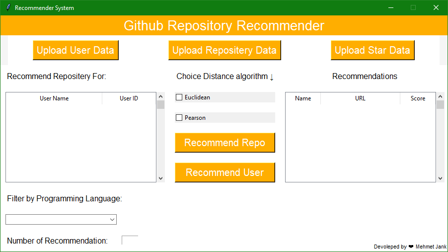
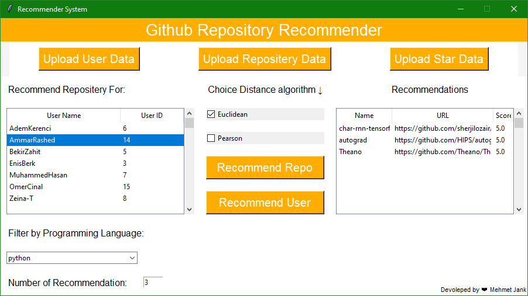
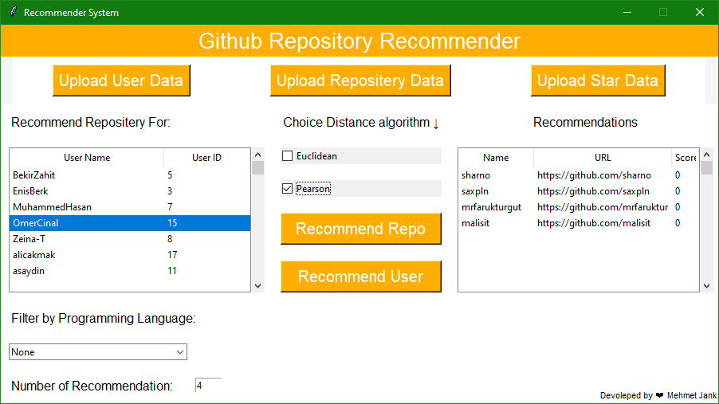

# Github Repository Recommender

This project is a repository and user recommendation system for GitHub. It recommends repositories and users based on user and repository data.
This is a school project for the "Advanced Python Programming" course at Istinye University, Turkey.

## Description

The `recommendation.py` file in this project is used to recommend repositories and users based on user and repository data. The recommendations are made using various similarity metrics and filtering options.

## Screenshots

Main Screen:

Repository Recommendations:

User Recommendations:

## How To Use

    1. Upload the required data files:

    1.1 - User Data: Upload a text file containing user data with the format: <id>,<username>,<github_url>

    1.2 - Star Data: Upload a text file containing star data with the format: <user_id>\t<repo_id1>,<repo_id2>,<repo_id3>...

    1.3 - Repository Data: Upload a text file containing repository data with the format: <repo_id>,<repository_name>,<url>,<language>

    2. Select the user for whom you want to recommend repositories from the "Recommend Repository For" list.

    3. Select the similarity metric (Euclidean or Pearson) and optionally choose a programming language filter.

    4. Click the "Recommend Repo" button to retrieve the recommended repositories.

    The recommended repositories will be displayed in the "Recommendations" section.
